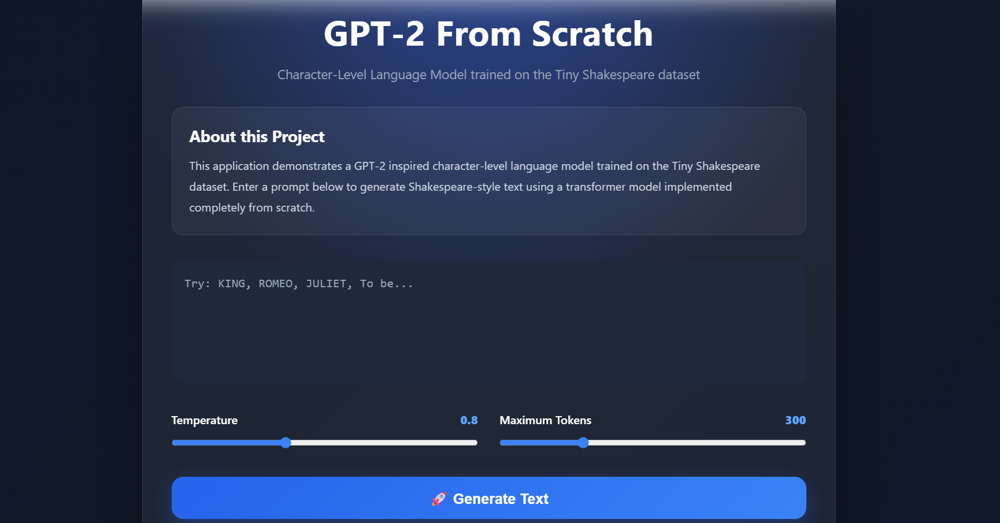
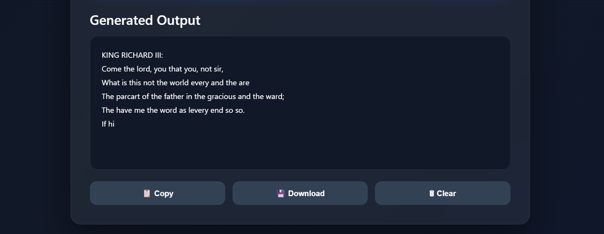
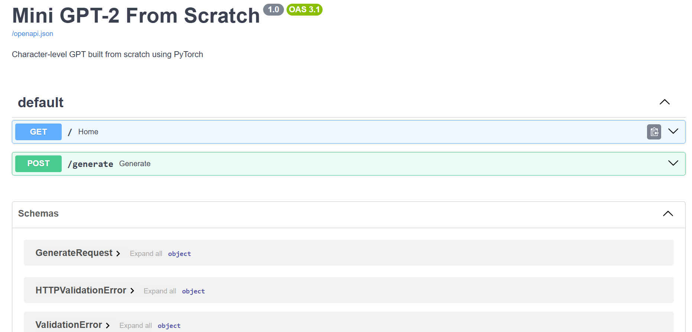

# GPT-2 From Scratch

A complete implementation of a **GPT-2 inspired Decoder-Only Transformer** built entirely from scratch using **PyTorch**, trained on the **Tiny Shakespeare** dataset, served through a **FastAPI** backend, and deployed with a **React + Vite** frontend.

---

# Project Overview

This project demonstrates the complete implementation of a miniature GPT-2 style language model without relying on high-level transformer libraries.

The objective of this project is to understand the internal workings of Transformer-based language models by implementing every major component manually, including:

- Character-Level Tokenization
- Embedding Layers
- Positional Embeddings
- Multi-Head Self-Attention
- Transformer Decoder Blocks
- Autoregressive Text Generation
- Model Training
- Model Inference

The trained model generates Shakespeare-style text from user-provided prompts through an interactive web application.

---

# Features

- Character-Level Tokenizer
- GPT-2 Inspired Decoder-Only Transformer
- Multi-Head Self-Attention
- Positional Embeddings
- Transformer Decoder Blocks
- Temperature-Based Sampling
- Text Generation
- Automatic Model Checkpoint Saving
- FastAPI REST API
- React + Vite Frontend
- Adjustable Temperature
- Adjustable Maximum Tokens
- Copy Generated Text
- Download Generated Text
- Responsive User Interface

---

# Project Architecture

```text
                  Tiny Shakespeare Dataset
                            │
                            ▼
                   Character Tokenizer
                            │
                            ▼
                 Character Embedding Layer
                            │
                            ▼
                Positional Embedding Layer
                            │
                            ▼
        Decoder-Only Transformer (GPT Style)
                            │
                            ▼
              Multi-Head Self Attention
                            │
                            ▼
                   Feed Forward Network
                            │
                            ▼
                     Language Model Head
                            │
                            ▼
                 Next Character Prediction
                            │
                            ▼
                     Generated Text Output
```

---

# Project Structure

```text
mini-gpt2-from-scratch/

│── assets/
│   ├── home.png
│   ├── output.png
│   └── swagger.png
│
├── backend/
│   └── main.py
│
├── checkpoints/
│   └── model.pth
│
├── data/
│   └── tinyshakespeare.txt
│
├── frontend/
│   ├── src/
│   ├── public/
│   └── package.json
│
├── notebook/
│   └── MiniGPT2.ipynb
│
├── outputs/
│   └── sample_output.txt
│
├── src/
│   ├── __init__.py
│   ├── attention.py
│   ├── dataset.py
│   ├── generate.py
│   ├── model.py
│   ├── tokenizer.py
│   ├── train.py
│   └── transformer.py
│
├── .gitignore
├── README.md
├── requirements.txt
├── test_dataset.py
└── test_tokenizer.py
```

---

# Technologies Used

| Category | Technology |
|-----------|------------|
| Programming Language | Python |
| Deep Learning Framework | PyTorch |
| Backend | FastAPI |
| Frontend | React |
| Build Tool | Vite |
| API Communication | Axios |
| Styling | CSS |
| Dataset | Tiny Shakespeare |

---

# Model Configuration

| Property | Value |
|----------|-------|
| Model Type | GPT-2 Inspired Decoder-Only Transformer |
| Tokenization | Character-Level |
| Dataset | Tiny Shakespeare |
| Context Length | 128 |
| Embedding Dimension | 128 |
| Attention Heads | 4 |
| Transformer Layers | 4 |
| Dropout | 0.2 |
| Optimizer | AdamW |

---

# Application Preview

## Home Page

Replace this image with your screenshot.

```text
assets/home.png
```



---

## Generated Output

```text
assets/output.png
```



---

## Swagger API Documentation

```text
assets/swagger.png
```



---

# Getting Started

## Clone the Repository

```bash
git clone https://github.com/sushantkurund/Celebal-Internship.git
```

```bash
cd mini-gpt2-from-scratch
```

---

## Create a Virtual Environment

### Windows

```bash
python -m venv env
env\Scripts\activate
```

### Linux / macOS

```bash
python3 -m venv env
source env/bin/activate
```

---

## Install Dependencies

```bash
pip install -r requirements.txt
```
---

# Model Training

Train the model using:

```bash
python -m src.train
```

During training, the model:

- Loads the Tiny Shakespeare dataset
- Performs character-level tokenization
- Trains the decoder-only Transformer
- Evaluates validation loss
- Saves the best-performing model checkpoint

The trained model is automatically saved to:

```text
checkpoints/model.pth
```

---

# Generate Text from Terminal

Generate text directly from the terminal:

```bash
python -m src.generate
```

Example Prompt

```text
KING
```

Example Output

```text
KING EDWARD IV:
Roman the shall law and his shall we, thou house;
And many we deservilure the maniston all the praying...
```

---

# Running the Backend

Start the FastAPI server:

```bash
uvicorn backend.main:app --reload
```

Backend URL

```
http://127.0.0.1:8000
```

Swagger Documentation

```
http://127.0.0.1:8000/docs
```

---

# Running the Frontend

Navigate to the frontend directory:

```bash
cd frontend
```

Install dependencies:

```bash
npm install
```

Start the React application:

```bash
npm run dev
```

Open:

```
http://localhost:5173
```

---

# Web Application

The web interface provides the following functionality:

- Prompt Input
- Temperature Control
- Maximum Token Control
- Generate Shakespeare-style Text
- Copy Generated Output
- Download Generated Output
- Clear Generated Output

---

# Sample Outputs

Sample generated outputs are available in:

```text
outputs/
```

This folder contains text generated by the trained language model.

---

# Notebook

The project notebook is available in:

```text
notebook/
```

It contains the complete experimentation and development workflow used while implementing and training the GPT model.

---

# Learning Outcomes

This project demonstrates practical implementation and understanding of:

- Character-Level Tokenization
- Embedding Layers
- Positional Embeddings
- Self-Attention Mechanism
- Multi-Head Self-Attention
- Transformer Decoder Architecture
- Autoregressive Language Modeling
- Temperature-Based Sampling
- PyTorch Model Development
- FastAPI Backend Development
- REST API Integration
- React Frontend Development

---

# Future Improvements

Possible enhancements include:

- Top-k Sampling
- Top-p (Nucleus) Sampling
- Beam Search Decoding
- Learning Rate Scheduler
- Mixed Precision Training
- Multilingual Training
- Word-Level Tokenization
- Larger GPT Configurations
- GPU Acceleration
- Docker Deployment

---

# References

- Andrej Karpathy's educational materials on Transformers and GPT models
- PyTorch Documentation
- FastAPI Documentation
- React Documentation
- Tiny Shakespeare Dataset

---

# Author

**Sushant Kurund**

Master of Computer Applications (Data Science)

GitHub

https://github.com/sushantkurund

---

# License

This project is developed for educational purposes to demonstrate the implementation of a GPT-2 inspired decoder-only Transformer architecture built entirely from scratch using PyTorch.