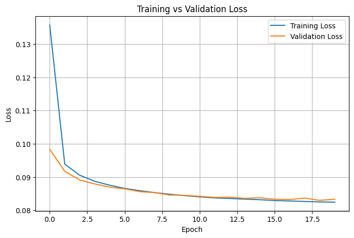
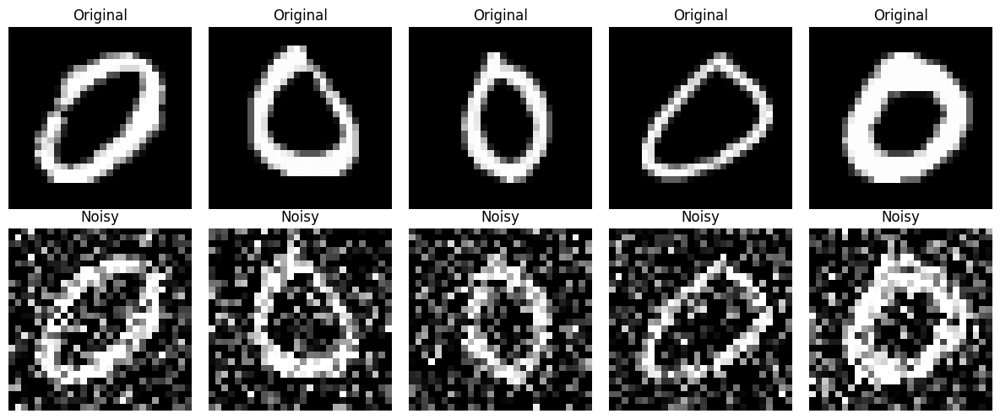
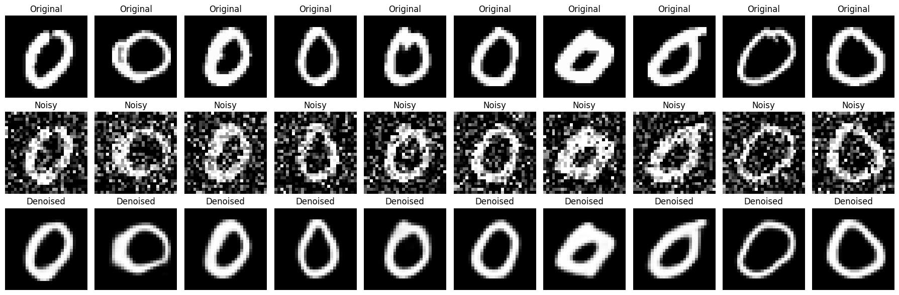

<div align="center">

# 🧠 Week 6 - Convolutional Denoising Autoencoder using MNIST

### Celebal Technologies Summer Internship 2026

Build and train a **Convolutional Denoising Autoencoder (CDAE)** to reconstruct clean handwritten digit images from noisy inputs using the **MNIST** dataset.


</div>

---

# 📌 Project Overview

This project demonstrates the implementation of a **Convolutional Denoising Autoencoder** using **TensorFlow** and **Keras**.

The model learns to remove **Gaussian noise** from handwritten digit images and reconstruct high-quality images while preserving important features.

---

# 🎯 Objectives

- Load and preprocess the MNIST dataset.
- Add Gaussian noise to input images.
- Build a Convolutional Denoising Autoencoder.
- Train the model using noisy-clean image pairs.
- Evaluate reconstruction quality using Mean Squared Error (MSE).
- Visualize the denoising performance.

---

# 📂 Dataset

This project uses the **MNIST PNG Dataset**.

> **Note:** The dataset is **not included** in this repository to keep the repository lightweight.

Place the provided `archive.zip` file in the project directory before running the notebook.

After extraction, the folder structure should be:

```text
mnist_png/
├── training/
└── testing/
```

---

# 🛠️ Tech Stack

- Python
- TensorFlow
- Keras
- NumPy
- Matplotlib
- Pillow (PIL)
- Scikit-learn

---

# 🏗️ Model Architecture

```
Input Image (28×28×1)
        │
Conv2D (32)
        │
MaxPooling2D
        │
Conv2D (64)
        │
MaxPooling2D
        │
 Bottleneck
        │
UpSampling2D
        │
Conv2D (64)
        │
UpSampling2D
        │
Conv2D (32)
        │
Conv2D (1)
        │
Denoised Image
```

---

# ⚙️ Model Configuration

| Parameter | Value |
|-----------|-------|
| Optimizer | Adam |
| Loss Function | Mean Squared Error (MSE) |
| Epochs | 20 |
| Batch Size | 128 |
| Validation Split | 10% |
| Callback | Early Stopping |

---

# 📈 Training Loss

> Save your loss graph as `assets/training_loss.png`

<p align="center">

</p>

---

# 🖼️ Original vs Noisy Images

> Save the screenshot as `assets/original_noisy.png`

<p align="center">

</p>

---

# ✨ Denoised Results

> Save the final comparison as `assets/denoised_results.png`

<p align="center">

</p>

---

# 📊 Results

- Successfully removed Gaussian noise from handwritten digit images.
- Training and validation loss decreased consistently.
- Early Stopping prevented overfitting.
- Generated high-quality reconstructed images.
- Achieved a low Mean Squared Error (MSE), indicating good reconstruction performance.

---

# 📁 Repository Structure

```text
week6/
│── assets/
│   ├── training_loss.png
│   ├── original_noisy.png
│   └── denoised_results.png
│
│── Week6_Sushant_DPGU.ipynb
└── README.md
```

---

# ▶️ How to Run

1. Clone this repository.
2. Place `archive.zip` inside the project directory.
3. Open the notebook in Google Colab or Jupyter Notebook.
4. Run all cells sequentially.

---

# 👨‍💻 Author

**Sushant Kurund**

MCA (Data Science)

Celebal Technologies Summer Internship 2026
